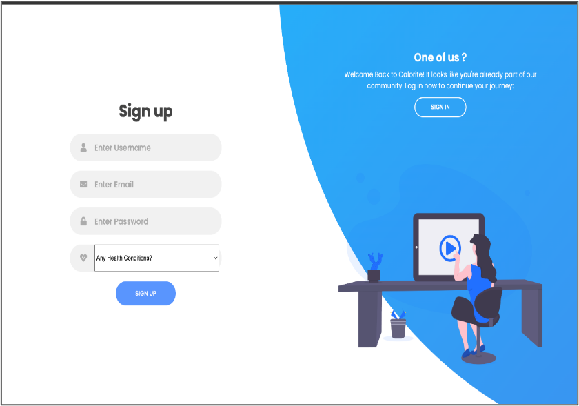
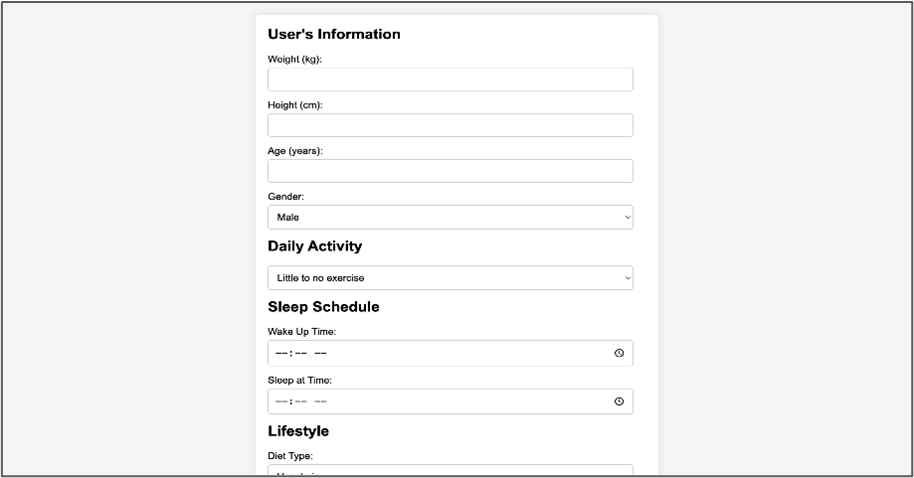
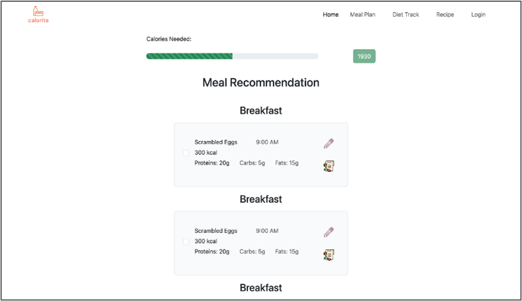
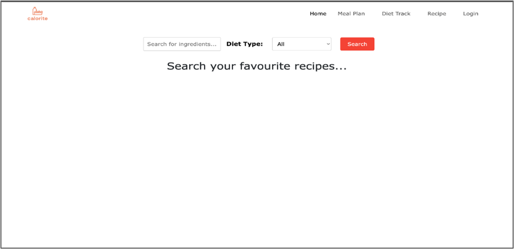
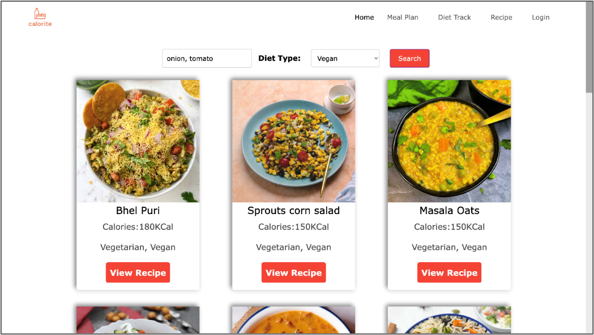
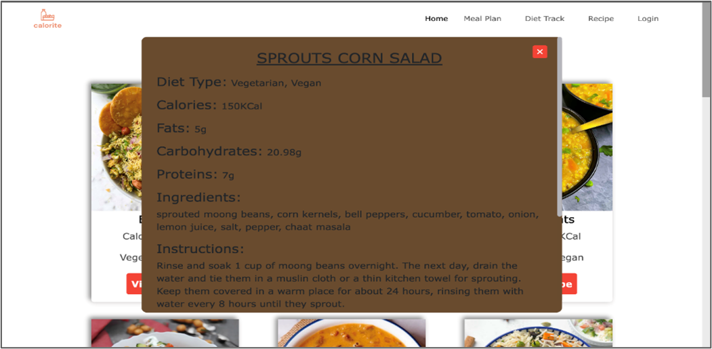
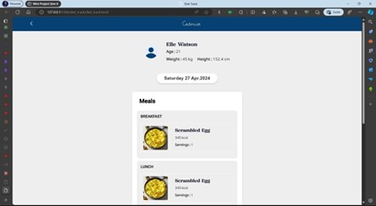

# Caloriet
Caloriet is <b>personalized diet recommendations web application</b> that provides personalized meal plans based on users' deatils.
  
Table of content:
<ol>
<li><a href="#problem">Problem Staement</a></li>
<li><a href="#objective">Objective</a></li>
<li><a href="#Overview">Motivation</a></li>
<li><a href="#architechture">Architechture</a></li>
<li><a href="#processdesign">Process Design</a></li>
<li><a href="#technical">Technical Requirements</a></li>
<li><a href="#designimp">Design & Implementation</a></li>
<li><a href="#futurescope">Future Scope</a></li>
</ol>
 

<h2 id="problem">Problem Statement</h2>
To address the absence of accessible and personalized nutritional advice appropriate to India's cultural and regional diversity. Despite the profusion of culinary materials, people frequently fail to sort through the large amount of dietary information available. There is also a demand for tools that promote successful meal planning and dietary tracking, allowing consumers to connect their eating habits with their health objectives.
 
<h2 id="objective">Objective</h2>
<ul>
<li>Develop a user-friendly web application catering to the diverse regional cuisines of India.</li>
<li>Provide personalized meal plans and dietary tracking functionalities to empower users to make informed dietary choices.</li>
<li>Offer a robust recipe recommendation system based on user preferences and available ingredients.</li>
</ul>
<h2 id="motivation">Motivation</h2>
The motivation behind our project stems from the recognition of the crucial role that diet plays in overall health and well-being. With India's rich and diverse culinary tradition, there is an abundance of nutritious and delectable recipes that can be used to encourage healthier eating habits. Furthermore, the development of digital platforms has opened possibilities for democratizing access to dietary information and personalized advice. By leveraging technology, we hope to bridge the gap between traditional dietary wisdom and modern lifestyle needs, empowering individuals to adopt healthier dietary practices.
 

<h2 id="architechture">Architechture</h2>
The diet recommendation website is built on a client-server approach, with the latest web development frameworks and technologies. The system have the following components:
<ol>
    <li>
        <h4>Client-Side Interface:</h4>
        
Created with HTML, CSS, and JavaScript, the client-side interface offers users an intuitive and interactive experience. It allows visitors to navigate the website, enter data, and view recommendations with ease.
 
    </li>
    <li>
        <h4>Server-Side Processing:</h4>
        
Server-side processing relies on Python as the scripting language and a web application framework, such as Flask. This component handles user queries, data processing, and personalized suggestions based on user input.
 
    </li>
    <li>
        <h4>Database Management:</h4>
        
User profiles, recipe data, meal plans, and other relevant data will be kept on Firebase, a cloud-based NoSQL database, with Flask serving as the backend framework. This technique allows for scalability and real-time data synchronization, ensuring efficient data storage and retrieval to support the system's functionalities.
 
    </li>
    <li>
        <h4>External APIs:</h4>
        
Integration with external APIs (Application Programming Interfaces) enables the website to access new data sources and services, expanding its capabilities and giving consumers complete recommendations. For example, the website might interface with nutrition databases or recipe repositories to gain access to nutritional information and grow its recipe bank. External APIs are accessible via HTTP (Hypertext Transfer Protocol) queries, and the server-side processing component processes the replies to provide relevant user recommendations.
 
    </li>
    <li>
        <h4>Overall Architecture:</h4>
        
The diet recommendation website's architecture is based on a client-server model, in which the client-side interface communicates with the server-side processing component to obtain data and functionality. The server-side processing component handles user requests, communicating with the database management component to retrieve and save data as needed. External APIs complement the website's data and functionality, improving the user experience and offering useful information for personalized suggestions.
 
    </li>
</ol>

<h2 id="processdesign">Process Design</h2>

 
The algorithm and process design of the diet recommendation website are essential components that drive the generation of personalized recommendations and facilitate user interaction. Here's a detailed overview of the algorithms and processes involved:
<ol>
    <li>
        <h4>Recipe Recommendation Algorithm</h4>
        
The recipe recommendation algorithm is at the heart of the website's recommendation engine, offering customers personalized meal choices based on their interests, dietary constraints, and accessible ingredients.  The method for recommending recipes based on user input, dietary preferences, and item availability is implemented in programming languages such as Python and PHP. The system generates personalized recommendations for users by considering aspects such as ingredient matching, user preferences, and nutritional analysis.  The algorithm works as follows:

        <ul>
            <li><h5>User Input :</h5>The algorithm starts by gathering user information, such as dietary preferences (e.g., vegetarian, vegan, non-vegetarian), and ingredients available.</li>
            <li><h5>Ingredient Matching :</h5>Next, the algorithm compares the user's input to recipes in the database that employ comparable components or fit the given dietary requirements. It generates relevant recipe suggestions based on product availability, nutritional value, and user preferences.</li>
            <li><h5>Personalization :</h5>The algorithm tailors the recommendations based on user-specific information such as nutritional goals, cooking ability level, and meal preferences. It uses user feedback and interaction data to fine-tune its recommendations over time.</li>
            <li><h5>Ranking and Presentation :</h5>Finally, the algorithm ranks the recommended recipes based on relevance and presents them to the user in an intuitive and visually appealing format. It may leverage criteria like recipe popularity, user reviews, and seasonality to improve the quality of recommendations.</li>
        </ul>
    </li>
    <li>
        <h4>Meal Planning Algorithm</h4>
        
The meal planning algorithm helps customers create personalized meal plans that are tailored to their dietary objectives, interests, and nutritional needs.  The algorithm for generating personalized meal plans based on user profiles, nutritional goals, and dietary restrictions is implemented using programming languages and frameworks such as Python, Flask, Django, or JavaScript. The algorithm takes into account nutritional balance, meal variety, and user feedback to provide balanced and diverse meal plans that are personalized to individual needs.  The algorithm generates balanced and different meal plans in a methodical manner:

        <ul>
            <li><h5>User Profile :</h5>The algorithm begins by analyzing the user's profile, which includes demographic information, dietary habits, and nutritional goals. It customizes the meal plan based on the user's age, gender, weight, height, exercise level, and dietary restrictions.</li>
            <li><h5>Nutritional Analysis :</h5>Next, the algorithm conducts a nutritional analysis of the user's dietary intake to identify any deficiencies or imbalances in macronutrients (carbohydrates, fats, proteins) and micronutrients (vitamins, minerals). It calculates the recommended daily intake of each nutrient based on established dietary guidelines and compares it with the user's actual intake.</li>
            <li><h5>Meal Composition :</h5>Based on the nutritional analysis and user preferences, the algorithm recommends meals for breakfast, lunch, supper, and snacks. It attempts for a macronutrient and micronutrient balance across meals while considering the user's taste preferences, cultural background, and cooking ability level.</li>
            <li><h5>Variety and Flexibility :</h5>The algorithm prioritizes variety and flexibility in meal planning, providing a varied selection of recipes and meal selections to avoid monotony and improve plan adherence. It enables users to tailor their meal plans by picking alternate recipes or altering portion amounts to their own requirements.</li>
            <li><h5>Long-Term Planning :</h5>In addition to daily meal planning, the algorithm facilitates long-term planning by allowing users to book meals ahead of time and establish weekly or monthly meal plans. It considers factors such as budget constraints, grocery availability, and social events to accommodate users' lifestyle and preferences.</li>
        </ul>
    </li>
    <li>
        <h4>Dietary Tracking Process</h4>
        
Dietary tracking allows users to track their daily macronutrient intake (carbohydrates, fats, and proteins) and progress towards nutritional objectives.  The algorithm for tracking users' daily macronutrient consumption and measuring their progress towards nutritional goals is implemented in computer languages and database query languages such as SQL. The program collects and analyses user data from the database, calculates nutritional indicators, and creates visualizations and reports to assist users in understanding their dietary patterns and making informed decisions.  The method includes the following steps:

        <ul>
            <li><h5>Data Collection :</h5>Users enter their daily food consumption into the website, either manually or by selecting from a prepared database of foods and recipes. The website keeps track of the amount and type of food ingested, as well as any additional information like mealtimes and dish sizes.</li>
            <li><h5>Nutritional Analysis :</h5>The website examines the nutritional value of the meals ingested, estimating the total intake of macronutrients and micronutrients for each meal and day.</li>
            <li><h5>Visualizations and Reports :</h5>The website generates visualizations and reports that display the user's dietary data in an understandable and helpful manner. These could include charts, graphs, and summaries that emphasize trends, patterns, and areas for improvement in the user's eating habits.</li>
            <li><h5>Feedback and Recommendations :</h5>Using dietary monitoring data, the website gives personalized feedback and recommendations to assist users make smart nutrition decisions. This may include advice for changing their diet, lowering portion sizes, or introducing more nutrient-dense foods.</li>
        </ul>
    </li>
</ol>

<h2 id="technical">Technical Requirements</h2>
<h4>Hardware</h4>
Operating devices such as Laptops, computers, smartphones, and tablets.
<h4>Software</h4>
<ul>
    <li>Operating System (OS)</li>
    <li>Web Server Software</li>
    <li>Database Management System (DBMS)</li>
    <li>Programming Languages and Frameworks</li>
    <li>External APIs and Services</li>
    <li>Security software, such as firewalls, intrusion detection systems (IDS), and antivirus software</li>
</ul>

<h2 id="designimp">Design & Implementation</h2>
<h3>Design</h3>
<ol>
    <li>
        <h4>Home Page</h4>
        
The landing page serves as the entry point to the website and is also referred to as the home page. It includes an introduction to the website, outlining its aim, features, and benefits.

        
        
        
        
    </li>
    <li>
        <h4>Login & Sign Up Page</h4>
        
The login/sign-up page allows users to access the website's restricted features by logging in or creating new accounts.

        
        
    </li>
    <li>
        <h4>BMR Page</h4>
        
Users can provide their personal information, such as age, gender, weight, and height. The website computes the Basal Metabolic Rate (BMR) using a suitable formula based on the user's input. The determined BMR value is shown to the user. Based on the computer BMR, the website recommends personalized meal plans to help users accomplish their health and fitness goals. Meal plans are designed to suit the user's energy needs while keeping a healthy diet.

        
    </li>
    <li>
        <h4>Meal Plan Page</h4>
        
The meal plan page allows users to examine their personalized meal plans by date. It provides menu alternatives for breakfast, lunch, dinner, and snacks, as well as recipes and nutritional information. Users can personalize their meal plans by adding or removing recipes, changing portion sizes, or indicating dietary preferences.

        
    </li>
    <li>
        <h4>Recipe Generator Page</h4>
        
The Recipe Search Page helps visitors select dishes based on available ingredients and dietary choices.

        
        
        
    </li>
    <li>
        <h4>Diet Track Page</h4>
        
Users can track their daily macronutrient intake (carbs, lipids, proteins) and progress towards nutritional goals. It gives users a summary of their current nutritional consumption, including total calories and macronutrient breakdown.

        
        
    </li>
</ol>
 
<h3>Implementation</h3>
The implementation phase of the diet suggestion website culminates the design and development work, yielding a functional system suitable for deployment. Here's a thorough summary of the installation process:
<ul>
    <li>
        <h4>Frontend Development :</h4>The website's frontend is built with HTML, CSS, and JavaScript to produce a visually appealing and intuitive user interface. This includes creating navigation menus, input forms, recipe displays, and nutritional charts to increase user participation and engagement.
    </li>
    <li>
        <h4>Backend Development :</h4>The website's backend is built using programming languages like Python or PHP, as well as web frameworks like Flask or Django. Server-side logic is created to handle user requests, process data, and generate personalized suggestions for recipes, meal planning, and dietary tracking.
    </li>
    <li>
        <h4>Database Integration :</h4>The website's data is efficiently stored and managed using Firebase, a cloud-based NoSQL database, in collaboration with Flask. This arrangement provides scalability and real-time data synchronization, meeting the website's specific needs. In addition, a bespoke dataset transformed into an API is used for recipe recommendations, which improves the website's functionality and user experience.
    </li>
    <li>
        <h4>Algorithm Implementation :</h4>The algorithms for recipe recommendation, meal planning, and nutritional tracking are implemented in the backend environment with programming languages and libraries designed for numerical calculation, data analysis, and machine learning. These algorithms employ user input, nutritional data, and machine learning techniques to provide personalized suggestions and insights to consumers.
    </li>
    <li>
        <h4>Testing & Quality Assurance :</h4>The website undergoes rigorous testing to verify its functioning, performance, and usability. This covers unit testing, integration testing, regression testing, and user acceptance testing to find and resolve any problems, errors, or usability concerns prior to release.
    </li>
    <li>
        <h4>Deployment and Monitoring :</h4>After testing is completed, the website is deployed to a production environment and made available to end users. Server configuration, security measures, performance optimization, and monitoring tools are all factors to consider when deploying a website to guarantee it runs consistently and efficiently in live environments.
    </li>
</ul>

<h2 id="futurescope">Future Scope</h2>
<ul>
    <li>Enhanced Personalization</li>
    <li>Integration with Wearable Devices</li>
    <li>Social Sharing and Community Engagement</li>
    <li>Advanced Analytics and Insights</li>
    <li>Expansion of Recipe Database</li>
</ul>